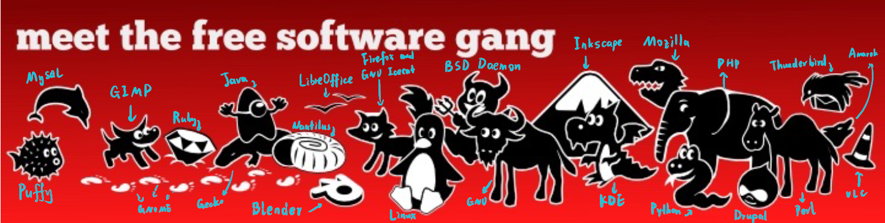
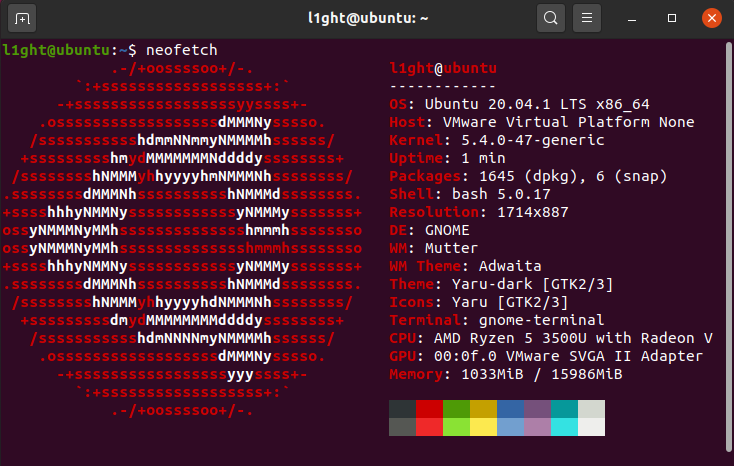
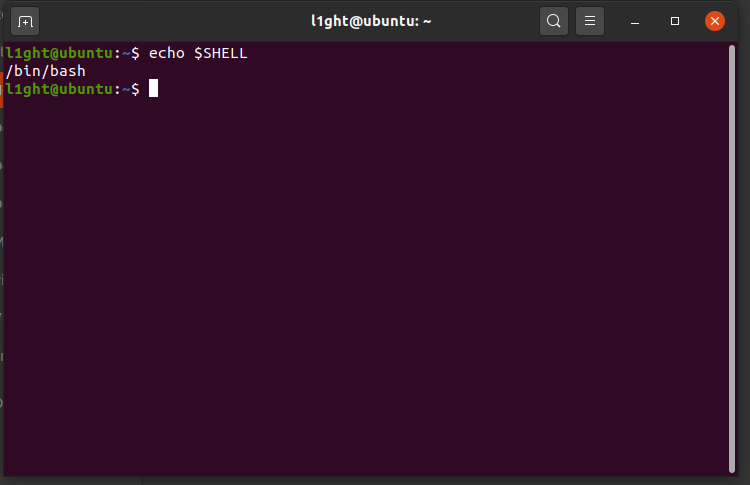
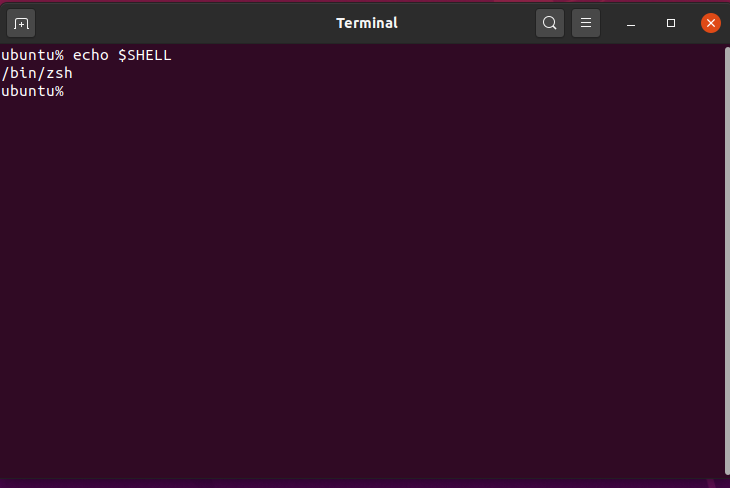
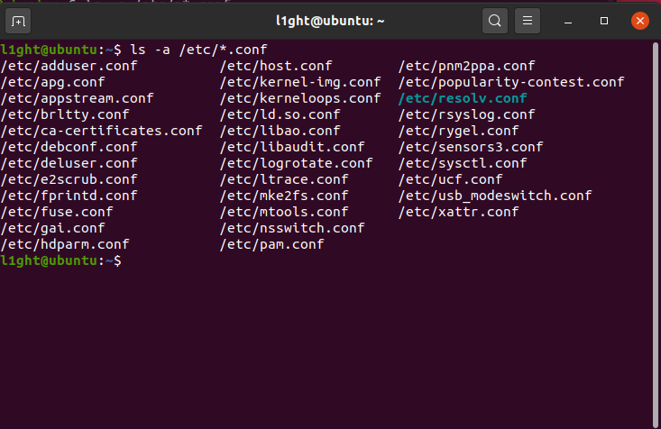
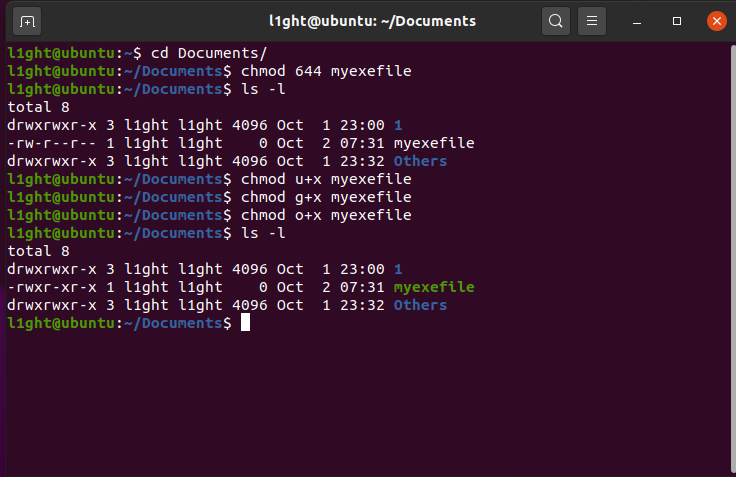
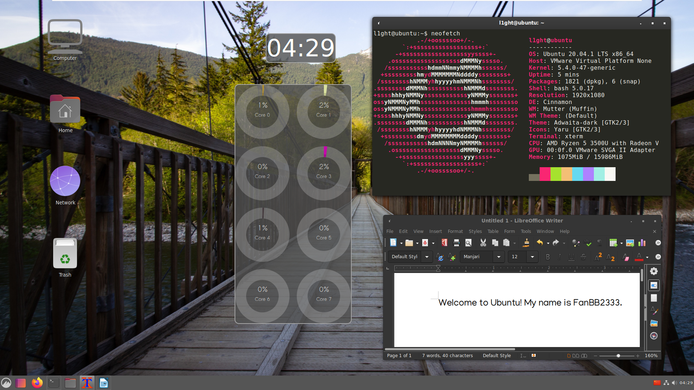

# Set 1 Answer Sheet

## Part 1

### 1-1 

① 不同于其他的如Python，Java 等语言（尽管有伪指针），C语言有显式指针，可以直接对已知地址的内存进行操作，搭配上free和malloc函数，使得操作系统能够（尤其是在中断发生时）高效迅速地完成需要的操作，也有利于操作系统的垃圾回收。

② 由于不同架构处理器的汇编语言不一样，但是C语言的宏有条件编译功能，可以为ARM和X86架构的处理器分别执行编译。

### 1-2

**相同点：**都由系统内核和程序组成，都由C及其衍生语言（Windows主要用C++）编写，都能运行在不同架构的处理器上，拥有某些相同的进程通信方式（如内存共享）（感觉相同点还不少）

**不同点：**① 某些进程通信方式不同：Unix里独有诸如管道，FIFO（命名管道）等通信方式

② Unix系统普遍为终端窗口，默认无图形界面，而Windows系统就是因拥有GUI而得来的名字

### 1-3

我支持Unix哲学，我觉得简单来说，Unix哲学就是简化原则，让程序专心负责他所需的事情，因为如果一个程序虽然能够实现各种花里胡哨的功能，但是连最基础的功能都实现不了，那它连**“能用”**都称不上，更不要说**“用的舒服”**了。尽管是在当下，这套理论仍然应该被重视，再大的工程如果能够被相对独立地分成许多小部分，一方面便于分配任务负责开发工作，另一方面在debug时每人只需要负责特定功能的实现，有利于后期的维护。（感觉这就是分而治之的思想）

### 1-4

题中说迅猛龙同学<u>忘了附上许可证</u>，但是基于这几种许可证开发的软件在发布时不论对许可证作何要求，前提都是要**有许可证**，迅猛龙这一番操作后不附许可证，这种行为确实有些危险。

GPL ：√  虽说GPL比较自由，但是仍需在发布时伴随GPL协议

GSPL：×

~~（不是很清楚，没有查到这个协议，只了解到LGPL协议对于新增代码的要求是也需满足LGPL协议，还找到了AGPL，FDL，但是还是没找到GSPL╮(╯﹏╰）╭）~~ 后来题改了，终

MIT：√ 相较于BSD协议更为宽松，但仍需保留原来代码中的MIT协议

APACHE：√ 每一个修改过的文件，都需要放置版权声明

BSD：√ 再发布的产品中如果包含源代码，需要带有原来程序的BSD协议

### 1-5

软件：FileZilla

许可证：GPL V2或更高版本（官方介绍点[这里](https://filezilla-project.org/license.php)）


### 1-6

如图，~~由于无法某些404的网站打不开,所以有两个元素没有找全(Ｔ▽Ｔ)~~

2020.10.3更新：好了重新买了梯子，打开了




### 1-7

我们通常所说的Linux，事实上指的是Linux内核，因为我们不论是把用CentOS说成“用Linux”，还是把用Arch Linux说成“用Linux”，事实上都是说的“用Linux内核的操作系统”，在我的观念里，一个操作系统就是将硬件所直接给出的一些不方便我们调用的“丑陋”接口加上一层外壳，使得用户方便调用（就像高级语言一样，毕竟我们不可能每次都写汇编吧.....）。这么看来，能被称之为“操作系统”的应当是一个个Linux发行版，也即Linux内核，加上一些GNU软件和系统的其他部件的合体。（感觉这种说法就像我们说“用Android”一样，但事实上用的操作系统名称却是EMUI，MIUI，ONEUI，别看这些系统都叫做什么什么UI，但事实上这些才是我观念里的“操作系统”，它们除了Android内核以外，还有许许多多的外围软件，共同构成“操作系统”）

### 1-8

#### 1.什么是虚拟机

在我的理解中，虚拟机就是在实体机的软件模拟出的相对隔离的硬件环境中装上操作系统的一台计算机。首先解释一下“相对隔离”：一些主要的共用物理硬件是隔离开来的，比如虚拟机和实体机共享一整块硬盘，虚拟机所用的硬盘只是实体机中划分出去的一部分，虚拟机和实体机共用电脑的物理内存，共用CPU的缓存，逻辑处理单元（但是利用一些CPU虚拟化的技术，如新出的Hyper-v能让CPU的利用率到最大），之所以说“相对”，是因为这种隔离不是绝对的，虽说在实体机看来，虚拟机不过是一个占用资源比较大的进程，但是事实上虚拟机和实体机并不仅仅是属于的关系。虚拟机使用的是实体机虚拟化出的网卡（在任务管理器中可以看到，我感觉目的是虚拟出一台同网段下的设备来分配IP），声卡，虚拟机可以通过同一内网和实体机相连，以用来共享文件，~~传播病毒~~

#### 2.在虚拟机中安装Ubuntu

OK！

#### 3. 安装neofetch

唔，因为电脑上本来就有VMware了，我就用的VMware  (｀・ω・´)



## Part 2

### 2-1

使用`sh`命令后，看似终端界面没有什么变化，还能正常输入字符，但是事实上shell已经由原本的`bash`换成了`sh`，那原来的`MY_VALUE`变量的值当然不能再拿来调用了，因为`MY_VALUE`变量值的有效范围仅限原来的`bash`。只是这里应该做的是无缝连接，所以原来的输入记录还在。

### 2-2

使用`export MY_VALUE=233`来定义环境变量，使得能够切换shell来调用原来的变量值，使用`export -p `命令能够在最后一行查看到刚刚定义的环境变量

P.S.好像`man export`用不了，得用`help export`才能调出帮助界面~~（如果这里的Hint中“man”只作“manual”的意思而不是特指命令请忽略前面句话）~~

### 2-3

`/etc/profile`是最高优先级的环境变量，在最后加上一行`export MY_VALUE=233`重启机器后便可直接调用环境变量`$MY_VALUE`

见配置文件`uploads\profile`


### 2-4

```shell
sudo useradd dino
sudo passwd 123456
sudoedit /etc/sudoers # 之后输入密码
# 光标移到root    ALL=(ALL:ALL) ALL下一行
# 输入dino    ALL=(ALL:ALL) ALL并保存退出
su dino # 切换至dino用户测试权限
sudo su # 用于检测是否有root的身份执行命令
```


### 2-5

以`l1ght:x:1000:1000:Ubuntu 20.04,,,:/home/l1ght:/bin/bash`为例

默认构成为 **“用户名:口令:用户标识号:组标识号:注释性描述:主目录:登录Shell”**

`l1ght`表示我的用户名，由不超过8个字符的字符串组成

`x`表示口令（passwd）是加密后的用户口令，不是明文（在这里都显示为x，应该是加密过后的）

第一个`1000`表示用户标识号（UID），取值是0-65536，如果几个用户名的UID一样，则系统视为同一个账户，但是可以有不同口令，主目录，登录Shell，0对应root

第二个`1000`表示用户组标识号（GID），GID与组名对应，再与/etc/group中的一条记录对应

`Ubuntu 20.04,,,`为注释性描述，一般没有实际用途，作注释用，在这里只是系统版本的标注(和安装系统时填写的名称有关)

`/home/l1ght`是主目录，也就是默认打开Shell后的工作目录，可以使用`pwd`命令看到

`/bin/bash`是登录Shell，也即直接打开终端后默认弹出的Shell，可以更改，下面会展示

当然，这只是某一行的构成，接下来讲解每一行代表什么

```
root:x:0:0:root:/root:/bin/bash
daemon:x:1:1:daemon:/usr/sbin:/usr/sbin/nologin
bin:x:2:2:bin:/bin:/usr/sbin/nologin
sys:x:3:3:sys:/dev:/usr/sbin/nologin
sync:x:4:65534:sync:/bin:/bin/sync
games:x:5:60:games:/usr/games:/usr/sbin/nologin
man:x:6:12:man:/var/cache/man:/usr/sbin/nologin
lp:x:7:7:lp:/var/spool/lpd:/usr/sbin/nologin
mail:x:8:8:mail:/var/mail:/usr/sbin/nologin
news:x:9:9:news:/var/spool/news:/usr/sbin/nologin
uucp:x:10:10:uucp:/var/spool/uucp:/usr/sbin/nologin
proxy:x:13:13:proxy:/bin:/usr/sbin/nologin
www-data:x:33:33:www-data:/var/www:/usr/sbin/nologin
backup:x:34:34:backup:/var/backups:/usr/sbin/nologin
list:x:38:38:Mailing List Manager:/var/list:/usr/sbin/nologin
irc:x:39:39:ircd:/var/run/ircd:/usr/sbin/nologin
gnats:x:41:41:Gnats Bug-Reporting System (admin):/var/lib/gnats:/usr/sbin/nologin
nobody:x:65534:65534:nobody:/nonexistent:/usr/sbin/nologin
systemd-network:x:100:102:systemd Network Management,,,:/run/systemd:/usr/sbin/nologin
systemd-resolve:x:101:103:systemd Resolver,,,:/run/systemd:/usr/sbin/nologin
systemd-timesync:x:102:104:systemd Time Synchronization,,,:/run/systemd:/usr/sbin/nologin
messagebus:x:103:106::/nonexistent:/usr/sbin/nologin
syslog:x:104:110::/home/syslog:/usr/sbin/nologin
_apt:x:105:65534::/nonexistent:/usr/sbin/nologin
tss:x:106:111:TPM software stack,,,:/var/lib/tpm:/bin/false
uuidd:x:107:114::/run/uuidd:/usr/sbin/nologin
tcpdump:x:108:115::/nonexistent:/usr/sbin/nologin
avahi-autoipd:x:109:116:Avahi autoip daemon,,,:/var/lib/avahi-autoipd:/usr/sbin/nologin
usbmux:x:110:46:usbmux daemon,,,:/var/lib/usbmux:/usr/sbin/nologin
rtkit:x:111:117:RealtimeKit,,,:/proc:/usr/sbin/nologin
dnsmasq:x:112:65534:dnsmasq,,,:/var/lib/misc:/usr/sbin/nologin
cups-pk-helper:x:113:120:user for cups-pk-helper service,,,:/home/cups-pk-helper:/usr/sbin/nologin
speech-dispatcher:x:114:29:Speech Dispatcher,,,:/run/speech-dispatcher:/bin/false
avahi:x:115:121:Avahi mDNS daemon,,,:/var/run/avahi-daemon:/usr/sbin/nologin
kernoops:x:116:65534:Kernel Oops Tracking Daemon,,,:/:/usr/sbin/nologin
saned:x:117:123::/var/lib/saned:/usr/sbin/nologin
nm-openvpn:x:118:124:NetworkManager OpenVPN,,,:/var/lib/openvpn/chroot:/usr/sbin/nologin
hplip:x:119:7:HPLIP system user,,,:/run/hplip:/bin/false
whoopsie:x:120:125::/nonexistent:/bin/false
colord:x:121:126:colord colour management daemon,,,:/var/lib/colord:/usr/sbin/nologin
geoclue:x:122:127::/var/lib/geoclue:/usr/sbin/nologin
pulse:x:123:128:PulseAudio daemon,,,:/var/run/pulse:/usr/sbin/nologin
gnome-initial-setup:x:124:65534::/run/gnome-initial-setup/:/bin/false
gdm:x:125:130:Gnome Display Manager:/var/lib/gdm3:/bin/false
l1ght:x:1000:1000:Ubuntu 20.04,,,:/home/l1ght:/bin/bash
systemd-coredump:x:999:999:systemd Core Dumper:/:/usr/sbin/nologin
dino:x:1001:1001::/home/dino:/bin/sh
```


**修改前**




**修改后（修改为`/bin/zsh` )使用z Shell**




### 2-6

xterm用途：也是一款虚拟终端，主要功能和GNOME自带的终端类似，但是支持很多自定义的扩展（感觉像是VSCode和记事本的区别）

依赖的软件包：

```
libc6 (>= 2.15) 
libc6 (>= 2.17) 
libc6 (>= 2.28) 
libfontconfig1 (>= 2.12.6)
libfreetype6 (>= 2.2.1)
libice6 (>= 1:1.0.0)
libtinfo6 (>= 6)
libutempter0 (>= 1.1.5)
libx11-6
libxaw7
libxext6
libxft2 (>> 2.1.1)
libxinerama1
libxmu6
libxpm4
libxt6
xbitmaps
```


### 2-7

P.S.以下软件均通过`Synaptic Package Manager`得到

|     分类     | Ubuntu Software | Ubuntu Software | Ubuntu Software |  Ubuntu Software   |  Other Software  |
| :------: | :------: | :--------: | :--------: | :------: | -------- |
| 仓库名称 | Main | Universe | Multiverse | Restricted | Partner |
| 特点（区别） | 官方支持，开源 | 社区维护，开源  | 不支持的，闭源 |    官方支持，闭源    | 第三方提供，闭源 |
| 举例 | gnome-terminal | xemacs21 | libcg | libnvidia-cfg1-418 | Skype |


### 2-8

```shell
n=5 # 以向上5级为例
for i in seq n;do cd ..;done # 利用for循环，此外也可以用 cd ../../../../../ 来实现
```

### 2-9

```shell
ls -A -d .* # -A参数用于显示除.和..以外的文件，-d只让终端显示出一级内容，.*用于显示以.开头的文件（隐藏文件）
```

### 2-10

```shell
ls -a /etc/*.conf # -a表示显示所有文件，p*.conf用于匹配以“.conf”结尾的文件
```



### 2-11

| 文件类型 | c（字符设备文件） | d（目录文件） |     b （块设备文件）      |     l（符号链接文件）     |
| :------: | :---------------: | :-----------: | :--------: | :--------: |
| 举例（文件名） |       agpgart |   bsg | loop0 | cdrom -> sr0 |
|  | 存储数据，以字节流为单位访问 | 目录 | 存储数据，以block为单位访问 | 类似于Win中的快捷方式 |

### 2-12

* 新建myexefile

  ```shell
  touch myexefile # 新建文件
  chmod 644 myexefile # 改权限为`-rw-r--r--`
  ```

* 可以将`chmod`参数中使用字母形式代替数字形式，如下
  
  ```shell
  chmod u+x myexefile #表示对该文件的拥有者加以文件执行的权限
  # 其它命令（应用到其它用户上）
  chmod g+x myexefile
  chmod o+x myexefile
  ```
  
  
  ### 补充-挂载
  
  所谓挂载，就是指将外接设备文件中的根目录连接到Linux文件目录下的某一目录，借助访问这个目录就可以对外接设备中的文件进行操作（当然，挂载一些网络共享文件夹也是通过`mount`命令来实现的）`/etc/fstab`文件中存储了被手动挂载后的挂载信息，使得下次开机后会自动挂载此文件中有的设备，而不用一次次都手动挂载。

### 2-13

在cd进入目标文件夹attachment后，用vim打开`I-love-unix.txt`文件，输入以下命令

```vim
:%s/unix/linux/g
:wq
```

再回到Shell，输入`mv I-love-unix.txtcolo I-love-linux.txt`以重命名

### 2-14

利用`vim`命令`:version`查看到个人设置在`$HOME/.vimrc`目录下，利用`vim`打开后即可编辑

配置文件见`uploads\.vimrc`

### 2-15

为了配置方便~~（Class.resource属性太多）~~，我在配置文件里采用了通配符`asterisk (`*`)` 

配置文件见`uploads\.Xresources`

### 2-16


