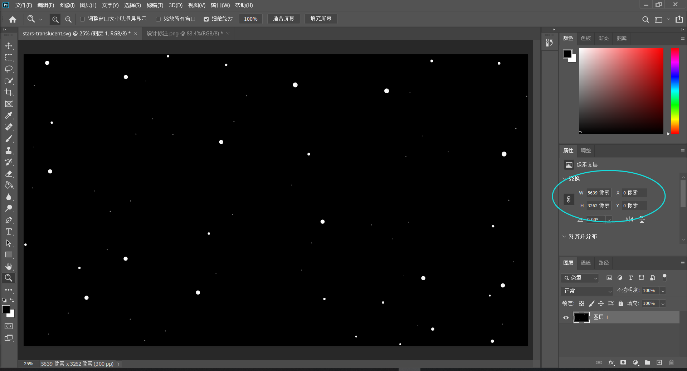
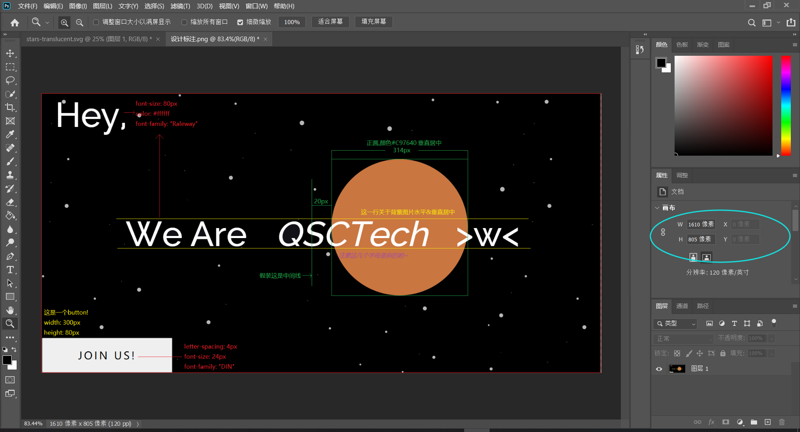

# 有些想说的话

1.无法同时做到“图片宽度占页面的85%”和“第一页高度和屏幕一样”，因为感觉给的图和设计图纸中的有些些不一样o(╥﹏╥)o

给的图长宽比不到2:1

但是设计图纸中长宽比约为2:1，也就是说给的图好像没有设计图纸中最右边那部分

2.在~~远古~~版本为11.508.19041.0的IE上无法正常使用flex-box，渲染出来会挤成一团，别的浏览器(包括使用Chrome内核的新版EDGE)均无此问题

3.不得不说，css动画太有意思了︿(￣︶￣)︿将来想学，(把鼠标放到下面三个产品的图标上就能看到)
